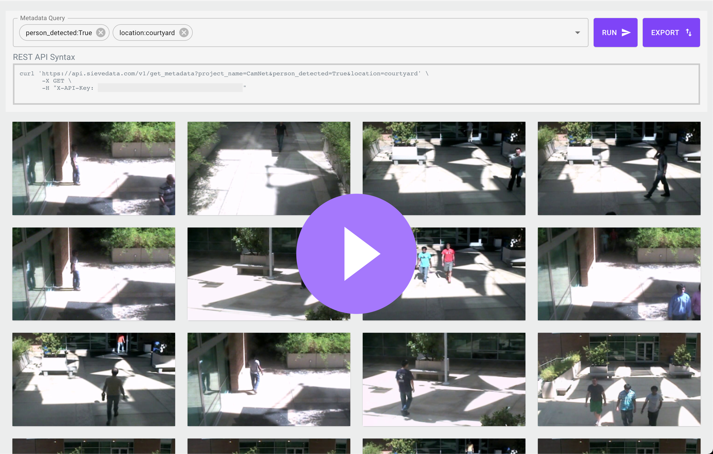
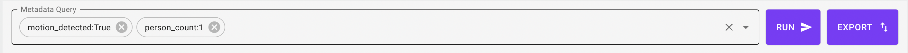
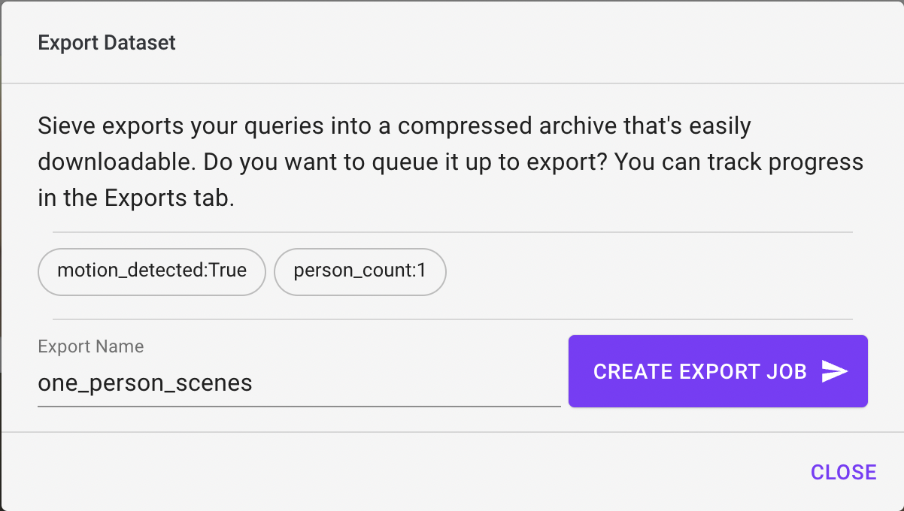
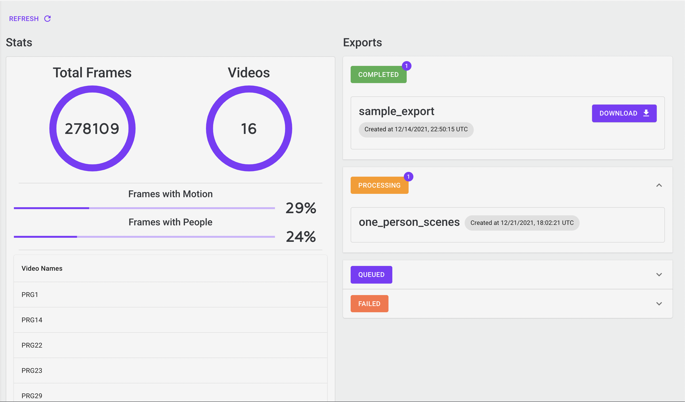

# Sieve Video Data Collection Example


Find samples that are interesting within hours of raw video, for free and completely automatically using [Sieve API](https://sievedata.com).

# Overview
Collecting visual data from a camera typically involves setting it up somewhere and writing a script that saves that footage on-device or in the cloud. Later accessing that data and finding what you want within it however becomes pretty difficult. Sieve makes this simple.

1. Write script that sends data to Sieve
2. Sieve processes video data efficiently and automatically
3. Query and download the exact images you want using Sieve Dashboard

# Getting Started
## Get a Sieve API Key
Fill out [this form](https://docs.google.com/forms/d/e/1FAIpQLSecOGSQEWH1KjPN68zzxV3XtGqxtvinGH-BRzVew2ovD6D49Q/viewform?usp=sf_link) to receive an API key within 10 minutes. It's completely free if it's for personal use or if you're a student. Otherwise, we'll contact you so you can learn more about pricing.

## Clone Repo and Install Dependencies
This repo has been tested with Python 3.7 in an isolated conda environment so to get started, we suggest using conda.

```
git clone https://github.com/Sieve-Data/Vid2Dataset.git
cd Vid2Dataset
conda create --name myenv python=3.7
pip install requirements.txt
```

## Run Script
Running this script will start securely pushing your data to Sieve. \
`python run.py --sieve_api_key YOUR_API_KEY`

## Custom Modifications

| Argument Name | Description | Default Value |
| ------------- | ----------- | ------------- |
| `video_push_interval` | How often video is pushed to Sieve (in seconds)   | 10 |
| `video_feed_path`  | The location of your video stream as taken in by OpenCV. If you have a webcam plugged in, this is some number depending on how many cameras you have plugged in  | 0 |

## Sieve Dashboard

[](https://youtu.be/_uyjp_HGZl4)

Watch the video above to learn more about how to use our dashboard. This repo has already taken care of the uploading videos section of it. To access your Sieve dashboard, all you need to do is visit the following link: \
`https://sievedata.com/app/query?api_key=YOUR_API_KEY`

## Export Dataset

1. Type your query into the dashboard \

2. Click export and choose a name for your export \

3. Go over to the "Project Info and Exports" tab to view progress of export. If your query is less than 100k samples, it should be done within a few minutes.

4. Click download and get the exact `curl` command for you to download the set of data anywhere.